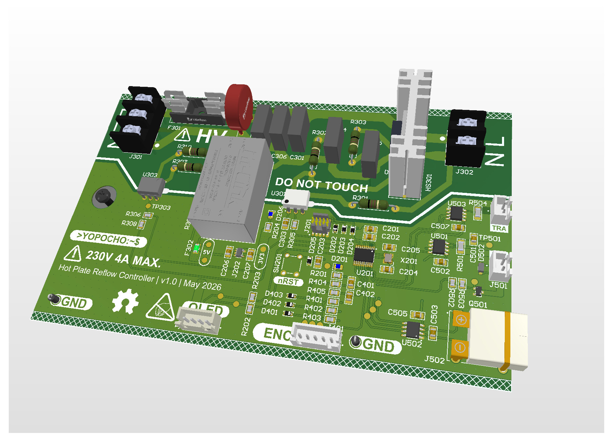

# Hot Plate Reflow Controller

[](https://www.rust-lang.org/)
[](https://embassy.dev/)
[](LICENSE)
[]()

A custom PCB-based reflow controller for surface-mount PCB assembly with thermocouple-based temperature feedback and embedded firmware control built with rust.

<div align="center">
  
</div>

## Overview

This repository contains the complete design and implementation of a hot plate reflow controller, including:
- **Firmware**: Embedded Rust implementation using the Embassy framework
- **Hardware**: PCB design files (Altium Designer) and electrical schematics
- **Mechanical**: Enclosure design for integration with heating element
- **Documentation**: Setup guides and operational documentation

### Target Hardware
- **Microcontroller**: STM32C071FBP6 (ARM Cortex-M0+)
- **Temperature Sensing**: K-type thermocouple input with signal conditioning
- **Power Stage**: In-series control of mains power (230V, 4A max)
- **Heating Element**: Electric flat-top griddle (900W max)

## Features

- OLED display with EC11 encoder-based menu UI
- K-Type thermocouple temperature feedback
- Configurable target temperature setpoint
- Automatic reflow profile following (TS319SNL solder paste curve)
- Simple temperature measurement mode

## Project Structure

```
.
├── src/
│   ├── main.rs              # Main firmware entry point
├── hardware/                # PCB design files (Altium) & enclosure design
├── docs/                    # Documentation and guides
├── Cargo.toml               # Rust project manifest
├── Cargo.lock               # Locked dependency versions
├── build.rs                 # Build script
├── Embed.toml               # Embedded debugging configuration
├── rust-toolchain.toml      # Pinned Rust version
└── README.md
```

## Firmware

### Prerequisites
- Rust toolchain (cargo 1.90.0)
- `thumbv6m-none-eabi` target: `rustup target add thumbv6m-none-eabi`
- `cargo-embed` for flashing: `cargo install cargo-embed`

### Building

```bash
cargo build --release
```

### Flashing

```bash
cargo embed --release
```

### Debugging

```bash
cargo run
```

## Hardware

### PCB & Enclosure
- **Design Tool**: Altium Designer
- **Files**: Located in `hardware/` directory
- **MCU**: STM32C071FBP6 (ARM Cortex-M0+)
- **Mains Interface**: TRIAC-based control for 230V AC switching
- **Current Rating**: 4A nominal (900W @ 230V)
- **Temperature Feedback**: Thermocouple signal conditioning and ADC interface

### Manufacturing
Designed for JLCPCB standard (most economical) manufacturing specifications.

## Documentation

For detailed usage and operational information, see the [User Guide](docs/USER_GUIDE.md).

## Getting Started

### Quick Start
TBD

## License

Licensed under the Apache License, Version 2.0. See [LICENSE](LICENSE) file for details.

## References

- [STM32C071FB Datasheet](https://www.st.com/content/st_com/en.html)
- [Embassy Framework Documentation](https://embassy.dev/)

---

**Status**: In Development

**Last Updated**: June 2026
